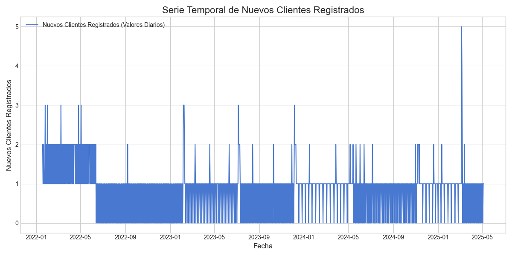
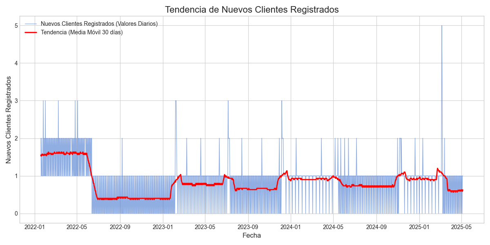
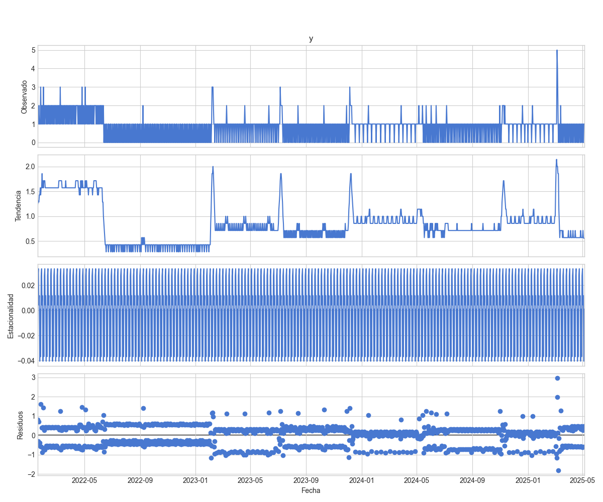
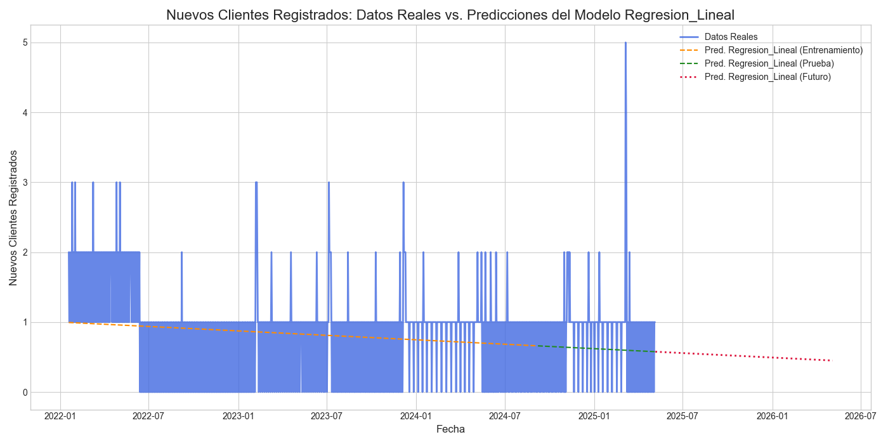
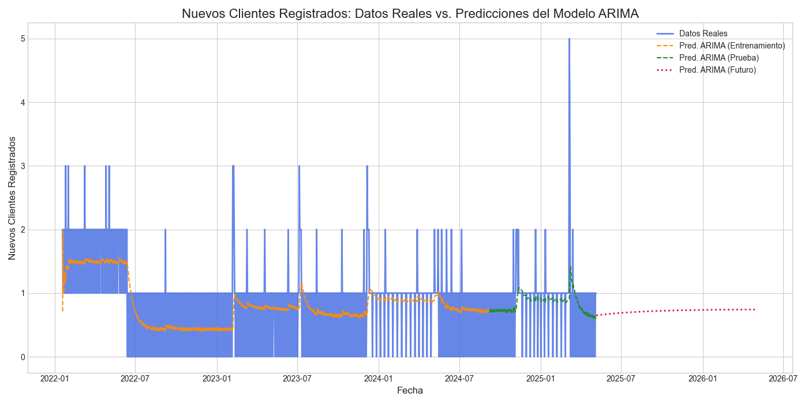
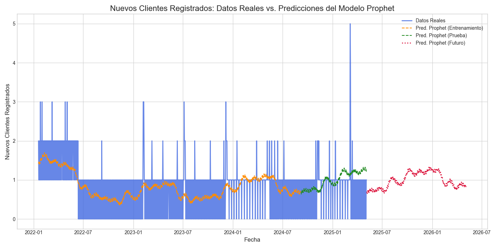
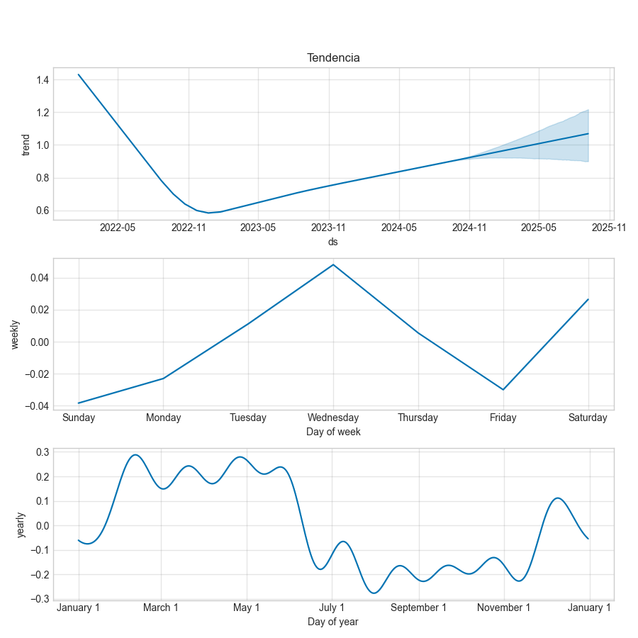

# Informe de Análisis y Predicción: Nuevos Clientes Registrados
**Fecha de Generación**: 01/06/2025 21:34:58

## 1. Introducción
Este informe detalla el análisis exploratorio y los resultados de los modelos predictivos para la métrica: **Nuevos Clientes Registrados**. El objetivo es comprender las tendencias históricas y proyectar valores futuros para apoyar la toma de decisiones.

## Análisis Exploratorio de Datos (EDA) para: Nuevos Clientes Registrados

El Análisis Exploratorio de Datos nos ayuda a entender las características principales de los datos antes de aplicar modelos predictivos.

### 1. Visualización de la Serie Temporal
El siguiente gráfico muestra la evolución de 'Nuevos Clientes Registrados' a lo largo del tiempo. Permite observar patrones generales, picos, valles y posibles anomalías.

### 2. Análisis de Tendencia
Se calcula una media móvil de 30 días para suavizar las fluctuaciones a corto plazo y visualizar la dirección general de la serie. Una media móvil representa el promedio de los datos sobre una ventana de tiempo deslizante.

**Conclusión de Tendencia**: La tendencia general observada es **descendente**.

### 3. Tasas de Crecimiento
- **Valor Inicial**: 2.00
- **Valor Final**: 1.00
- **Crecimiento Total en el Período**: -1.00 unidades.
- **Crecimiento Porcentual Total**: -50.00%.
- **Tasa de Crecimiento Mensual Promedio (Compuesta)**: -1.74%. Esta tasa indica el crecimiento promedio mensual si el crecimiento se reinvirtiera cada mes.

### 4. Descomposición Estacional
La descomposición de series temporales separa los datos en varios componentes:
- **Tendencia**: La dirección general a largo plazo de los datos.
- **Estacionalidad**: Patrones que se repiten en intervalos fijos (ej. semanalmente, anualmente).
- **Residuos**: La parte de los datos que queda después de remover la tendencia y la estacionalidad (ruido aleatorio).
Se ha realizado una descomposición asumiendo un ciclo estacional de 7 días (semanal).

## 3. Modelado Predictivo y Resultados
Se han aplicado varios modelos de series temporales para predecir los próximos **365 días** de 'Nuevos Clientes Registrados'.
Los modelos se evalúan utilizando el Error Absoluto Medio (MAE) y la Raíz del Error Cuadrático Medio (RMSE) sobre un conjunto de datos de prueba (típicamente el 20% más reciente de los datos históricos, no utilizado durante el entrenamiento del modelo).
- **MAE**: Mide el promedio de los errores absolutos. Un MAE de X significa que, en promedio, las predicciones del modelo se desvían en X unidades del valor real.
- **RMSE**: Similar al MAE, pero penaliza más los errores grandes. Si el RMSE es significativamente mayor que el MAE, indica la presencia de algunos errores de predicción grandes.
**Valores más bajos de MAE y RMSE indican un mejor rendimiento del modelo en el conjunto de prueba.**

### 3.1 Modelo: Regresion Lineal
**Gráfico de Predicciones (Regresion Lineal)**:
El gráfico muestra los datos reales (azul), las predicciones sobre el conjunto de entrenamiento (naranja), las predicciones sobre el conjunto de prueba (verde) y las predicciones futuras (rojo).

**Métricas de Evaluación en Conjunto de Prueba**:
- Error Absoluto Medio (MAE): **0.50**
- Raíz del Error Cuadrático Medio (RMSE): **0.63**
  (Contextualizar estos valores con la escala de 'Nuevos Clientes Registrados' observada en el EDA).

### 3.2 Modelo: ARIMA
**Gráfico de Predicciones (ARIMA)**:
El gráfico muestra los datos reales (azul), las predicciones sobre el conjunto de entrenamiento (naranja), las predicciones sobre el conjunto de prueba (verde) y las predicciones futuras (rojo).

**Métricas de Evaluación en Conjunto de Prueba**:
- Error Absoluto Medio (MAE): **0.38**
- Raíz del Error Cuadrático Medio (RMSE): **0.58**
  (Contextualizar estos valores con la escala de 'Nuevos Clientes Registrados' observada en el EDA).

### 3.3 Modelo: Prophet
**Gráfico de Predicciones (Prophet)**:
El gráfico muestra los datos reales (azul), las predicciones sobre el conjunto de entrenamiento (naranja), las predicciones sobre el conjunto de prueba (verde) y las predicciones futuras (rojo).

**Métricas de Evaluación en Conjunto de Prueba**:
- Error Absoluto Medio (MAE): **0.43**
- Raíz del Error Cuadrático Medio (RMSE): **0.65**
  (Contextualizar estos valores con la escala de 'Nuevos Clientes Registrados' observada en el EDA).

**Análisis de Componentes (Prophet)**:
Prophet descompone la serie temporal en tendencia, estacionalidad anual y semanal (si se detectan y activan). Esto ayuda a entender los factores que impulsan las predicciones.

- **Tendencia**: Muestra la dirección general a largo plazo.
- **Estacionalidad Semanal**: Patrones que se repiten cada semana (ej. picos los fines de semana).
- **Estacionalidad Anual**: Patrones que se repiten cada año (ej. aumento de ventas en ciertas temporadas).

## 4. Conclusiones Generales e Interpretación
Al interpretar estos resultados, considera lo siguiente:
- **Comparación de Modelos**: El modelo con los valores MAE y RMSE más bajos en el conjunto de prueba generalmente se considera el más preciso para los datos históricos recientes. Sin embargo, la simplicidad del modelo y su interpretabilidad también son importantes.
- **Coherencia con el EDA**: Las predicciones futuras deben ser lógicas y, en general, coherentes con las tendencias y estacionalidades identificadas en el Análisis Exploratorio de Datos. Desviaciones significativas deben ser investigadas.
- **Incertidumbre de las Predicciones**: Las predicciones futuras siempre conllevan incertidumbre, que tiende a aumentar cuanto más lejano es el horizonte de predicción. Los gráficos de predicción pueden dar una idea visual de esta incertidumbre (ej. si los modelos divergen mucho).
- **Advertencias del Modelo**: Presta atención a cualquier advertencia impresa en la consola durante la ejecución del script (ej. `ConvergenceWarning` para ARIMA), ya que pueden indicar problemas con el ajuste del modelo.
- **Contexto del Negocio**: Finalmente, las predicciones deben ser evaluadas en el contexto del negocio. ¿Tienen sentido? ¿Son accionables?

Se recomienda revisar este informe periódicamente con datos actualizados para refinar los modelos y las predicciones.

---
*Fin del informe. Los gráficos y este archivo Markdown se encuentran en la carpeta: `./docs/proyecto/analisis_resultados_amaluz`*